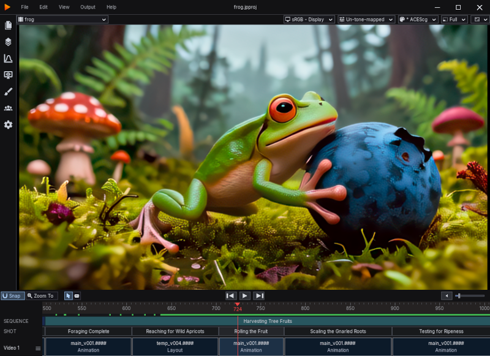
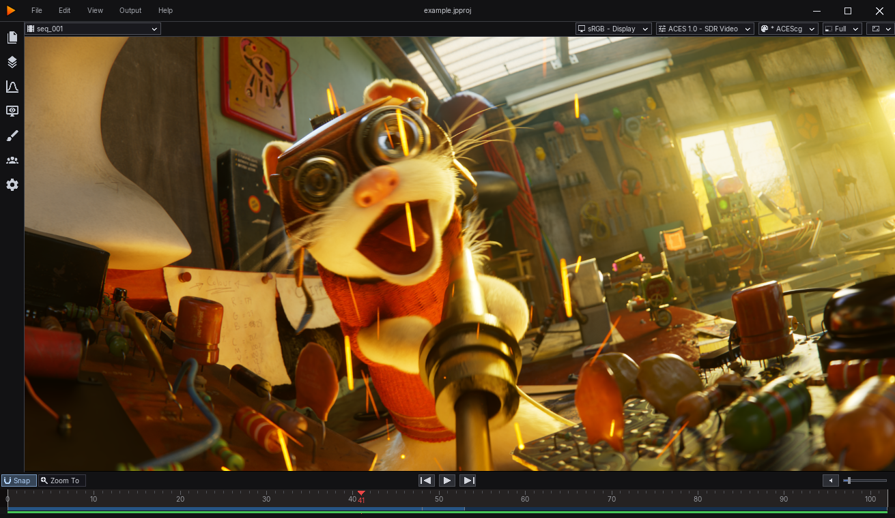

# jplay

A lightweight, performance-first flipbook player for reviewing image sequences and
movies files.

## Features

- Real-time playback of EXR sequences, still images and movies (ProRes, H.264, MXF, …)
- Proxy/full media switching
- OpenColorIO
- OpenTimelineIO
- Extended desktop, NDI and DeckLink SDI support
- Local control channel (JSON over loopback TCP) for MCP servers etc

## Screenshots

<table>
<tr>
<td align="center">Timeline view </td>
<td align="center">Compact player mode </td>
</tr>
</table>

## Documentation

**Start here**

- [Getting started](docs/GETTING_STARTED.md) — supported formats, timecode vs
  frames, the naming convention, and building a timeline from a directory
- [Mouse and keyboard shortcuts](docs/SHORTCUTS.md)

**Review**

- [Presentation mode](docs/PRESENTATION_MODE.md) — fullscreen, review monitor,
  NDI / SDI output, burn-in, letterbox
- [Sync session](docs/SYNC_SESSION.md) — LAN review, one host and many spectators
- [Draw tool](docs/DRAW_TOOL.md) — pencil annotations
- [Proxy modes](docs/PROXY_MODES.md) — the global media-representation switch

**Colour**

- [Colour management](docs/COLOUR_MANAGEMENT.md) — OCIO, and how a config is resolved
- [Colour tools](docs/COLOR_TOOLS.md) — grading, tech check, pixel inspector
- [Colour inspect](docs/COLOR_INSPECT.md) — what is actually on screen, and where

**Configuring and extending**

- [Config files](docs/CONFIG_FILES.md) — `jplay_preferences.conf`, `naming_convention.conf`
- [Python](docs/PYTHON.md) — `jplay_init.py`, the callbacks, site overrides
- [MCP control channel](docs/MCP_CONTROL_CHANNEL.md) — driving jplay from another process
- [Building the player](docs/BUILDING.md)
- [Adding a panel](docs/ADDING_A_PANEL.md)

## Dependencies

[SDL3](https://libsdl.org) ·
[FFmpeg](https://ffmpeg.org) ·
[OpenEXR](https://openexr.com) / [Imath](https://github.com/AcademySoftwareFoundation/Imath) ·
[OpenColorIO](https://opencolorio.org) ·
[OpenTimelineIO](https://opentimeline.io) ·
[shaderc](https://github.com/google/shaderc) ·
[pybind11](https://github.com/pybind/pybind11) ·
[FreeType](https://freetype.org) ·
[RapidJSON](https://rapidjson.org)
